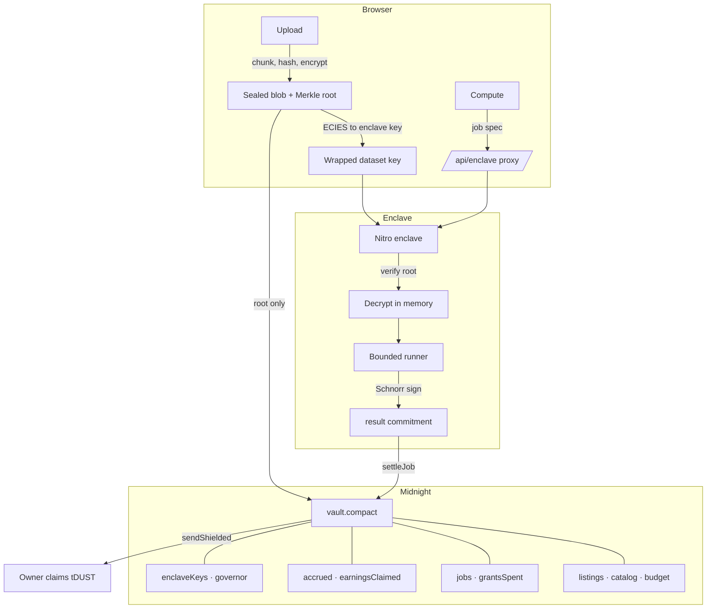

<div align="center">


# Zylo

### They buy the answer. Never the data.

*A confidential data vault on Midnight — Compact circuits, zero-knowledge proofs, and attested compute*


**Live on Midnight preview**

[`1951fd9ca36d14c1458c27c80d2f0b7d2d7437c187c875e4d1d28acd9a215882`](https://explorer.preview.midnight.network/contracts/1951fd9ca36d14c1458c27c80d2f0b7d2d7437c187c875e4d1d28acd9a215882)

</div>

---

## Deployed contract

The vault is live on Midnight **preview**. All six verifier keys are published on chain and
the governor commitment is fixed.

| | |
|---|---|
| Address | [`1951fd9ca36d14c1458c27c80d2f0b7d2d7437c187c875e4d1d28acd9a215882`](https://explorer.preview.midnight.network/contracts/1951fd9ca36d14c1458c27c80d2f0b7d2d7437c187c875e4d1d28acd9a215882) |
| Deploy tx | [`11c63a2b42f580431d7f6190e07beccb36d32f6d2fb732a89e66c8f254da1fe6`](https://explorer.preview.midnight.network/transactions/11c63a2b42f580431d7f6190e07beccb36d32f6d2fb732a89e66c8f254da1fe6) |
| Block | 891,017 |
| Network | `preview` — node 1.x, ledger v8 |
| Explorer | [Night Scan](https://explorer.preview.midnight.network/contracts/1951fd9ca36d14c1458c27c80d2f0b7d2d7437c187c875e4d1d28acd9a215882) |

To point the app at it, put the address in `app/.env.local`:

```bash
NEXT_PUBLIC_vault_ADDRESS=1951fd9ca36d14c1458c27c80d2f0b7d2d7437c187c875e4d1d28acd9a215882
```

---

## What is Zylo?

Data marketplaces sell a download and trust you to behave. The moment a buyer has the rows,
the seller has lost the data, the leverage, and any say in what happens next. So the
valuable datasets never get listed, and the ones that do are the ones nobody minds leaking.

Zylo never hands the data over. You publish a dataset that is encrypted in your browser
before a byte leaves the machine; only a Merkle commitment, a schema and a price reach the
chain. A buyer pays for a *computation*. An enclave whose signing key is allowlisted
on-chain verifies the commitment, decrypts in memory, runs a bounded query, signs the
answer and forgets the key. You claim your tDUST later, in a transaction nothing links back
to the job that earned it.

**Three ways in:**

- **Publish** — encrypt and list a dataset; the offer is public, the contents never are.
- **Compute** — buy an aggregate over someone else's data without seeing a row.
- **Earn** — claim accrued tDUST unlinkably, whenever you choose.

> The differentiator is not encryption — anyone can encrypt a file. It is that the chain
> enforces *which* bytes were computed on, *which* enclave was allowed to see them, that
> payment happened, and that none of it can be correlated. The data never becomes a
> download, because a download was never what was sold.

---

## Features

### Contract — `contracts/vault.compact`

- **Sealed listings** — a dataset is a Merkle root plus a hiding commitment to its owner.
  The catalog is public so the market is browsable; the rows, the owner and the buyer are not.
- **Blind job targeting** — `requestJob` takes the dataset as a *private* input and proves a
  Merkle path into the listings tree plus `escrow >= price`. The ledger learns a job exists
  and what it escrowed, never which dataset it points at.
- **In-circuit attestation** — key release is gated on a Schnorr signature over Jubjub,
  verified inside the circuit against an allowlisted enclave key.
- **Unlinkable earnings** — settlement accrues to a commitment; the owner claims in a
  separate transaction with its own nullifier.
- **Query budgets** — every listing carries a budget decremented on each job. Exhaustion
  requires a new listing, capping how much any one dataset can be probed.

| Circuit | Proves | Reaches the ledger |
|---|---|---|
| `registerDataset` | the owner holds a secret binding this Merkle root | listing leaf, public terms, budget |
| `requestJob` | escrow covers *some* listed dataset's price | job id, escrow, spec commitment |
| `grantAccess` | an allowlisted enclave signed this job id | grant nullifier |
| `settleJob` | that enclave signed this result, after a grant | result commitment, accrual |
| `claimEarnings` | the claimant owns the dataset that accrued | payout nullifier, coin out |
| `allowlistEnclave` | the caller is the governor | enclave fingerprint |

### Enclave — `enclave/`

- **Root verification before decryption** — a blob whose Merkle root does not match the
  on-chain commitment aborts before any plaintext exists.
- **A bounded query language** — counts, aggregates, grouped aggregates. No arbitrary code,
  no row-level output, ever.
- **Anti-exfiltration limits** — minimum group size 25, at most 64 groups, 8 KB result cap.
  Groups below the minimum are dropped rather than reported.
- **Optional differential privacy** — Laplace noise at a caller-supplied epsilon, with
  per-aggregate sensitivity.
- **Key hygiene** — dataset key and plaintext zeroed in a `finally` block.
- **Honest attestation** — off Nitro it reports `attested: false` and says not to allowlist it.

### App — `app/`

- Client-side chunking, SHA-256 Merkle commitment and AES-256-GCM encryption.
- Lace wallet connection through the Midnight DApp connector.
- Exportable secrets, because losing them means losing your earnings.
- A photographic, editorial interface: a full-bleed landing with an interactive scanner
  canvas, then a sidebar dashboard. Self-hosted DM Sans, no utility CSS framework.
- Verified at 1440px, 390px and 320px with no horizontal overflow.

---

## Architecture



| Component | Role | Backed by |
|---|---|---|
| `contracts/vault.compact` | consent, integrity, escrow, unlinkability | Compact 0.23, ledger v8 |
| `crypto/` | chunking, Merkle, AES-GCM, ECIES key wrap | Web Crypto + Jubjub |
| `enclave/` | attested compute and the bounded runner | Node, AWS Nitro |
| `app/` | publish, browse, compute, claim | Next.js 16, React 19 |

### What Midnight enforces — and what it does not

**Enforced cryptographically:** that the enclave computed on exactly the committed bytes;
that only an allowlisted enclave key could unlock them; that escrow covered the listed
price; that a job settles once and earnings are claimed once; that jobs, payouts and owners
cannot be correlated on chain.

**Not enforced:** that the computation was *correct*. That rests on hardware attestation,
not a proof — a broken TEE is a broken result. And an adversarial buyer can still learn
something through results; the bounded DSL, group minimums, caps and budgets narrow that
channel, they do not close it.

**The governor is trusted** to allowlist only keys backed by a genuine attestation of a
reproducible build. That assumption narrows with published measurements and a multisig. It
does not disappear.

---

## The bounded query language

| Job class | Shape | Guard |
|---|---|---|
| `count` | rows matching an optional predicate | selection ≥ 25 rows |
| `aggregate` | `sum` / `mean` / `min` / `max` over one column | selection ≥ 25 rows |
| `grouped` | an aggregate per group | ≥ 25 rows per group, ≤ 64 groups |

Every result is JSON capped at 8 KB. A job outside the listing's permitted classes is
refused before decryption.

## Circuit cost

Measured, not estimated — `managed/vault/keys/` after `npm run compile`:

| Circuit | Proving key |
|---|---|
| `allowlistEnclave` | 4.97 MB |
| `grantAccess` | 5.47 MB |
| `settleJob` | 5.47 MB |
| `registerDataset` | 9.50 MB |
| `requestJob` | 9.53 MB |
| `claimEarnings` | 9.56 MB |

48 MB total, downloaded once and cached. SHA-256 dominates: a single `persistentHash` costs
~2.8 MB while a full Schnorr verification over Jubjub costs 687 KB. `sendShielded` is the
heaviest primitive at ~10 MB, which is why `claimEarnings` is the largest circuit.

---

## Project structure

```
zylo/
├── contracts/vault.compact      # the one contract, six circuits
├── managed/vault/               # compiled circuits + proving keys (committed)
├── crypto/
│   ├── merkle.ts                   # 1 MiB chunking, domain-separated Merkle root
│   ├── envelope.ts                 # AES-256-GCM seal/open, root checked on open
│   ├── keywrap.ts                  # ECIES to the enclave's Jubjub key
│   └── attestation.ts              # Schnorr over Jubjub, shared with the circuit
├── enclave/
│   ├── enclave.ts                  # job lifecycle, key hygiene
│   ├── runner.ts                   # bounded DSL, k-anonymity, Laplace noise
│   ├── jobspec.ts                  # job classes and limits
│   ├── attest.ts                   # Nitro measurement, boot keypair
│   └── server.ts                   # HTTP surface
├── tests/
│   ├── vault.test.ts            # 32 contract tests
│   ├── enclave.test.ts             # 16 runner and enclave tests
│   ├── crypto.test.ts              # 12 crypto tests
│   ├── e2e.test.ts                 # dataset -> enclave -> contract, end to end
│   └── vault-simulator.ts       # offline ledger harness
├── app/                            # Next.js 16 + Capacitor
│   ├── app/page.tsx                # landing
│   ├── app/(app)/                  # datasets · upload · catalog · compute · earnings · settings
│   ├── app/api/enclave/            # server-side proxy to the enclave
│   ├── app/styles/                 # landing.css · dashboard.css · app.css
│   ├── app/src/components/         # landing, dashboard shell, auth, ui primitives
│   └── app/src/midnight/           # wallet, providers, secrets, local store
├── REFACTOR.md                     # the plan this was built from, annotated
└── spikes/RESULTS.md               # Phase 0 measurements
```

---

## Setup

```bash
# 1. Toolchain
nvm use 22
curl --proto '=https' --tlsv1.2 -LsSf \
  https://github.com/midnightntwrk/compact/releases/latest/download/compact-installer.sh | sh
compact update 0.31.1   # ledger v8 / runtime 0.16 — what preview runs

# 2. Contract, crypto and enclave
cd zylo
npm install
npm run compile        # -> managed/vault/
npm test               # 61 tests

# 3. Enclave (second terminal)
npm run enclave        # http://localhost:8088

# 4. App (third terminal)
cd app
npm install
cp .env.example .env.local
echo "NEXT_PUBLIC_vault_ADDRESS=1951fd9ca36d14c1458c27c80d2f0b7d2d7437c187c875e4d1d28acd9a215882" >> .env.local
npm run dev            # http://localhost:3000 (falls back to 3001 if taken)
```

| Variable | Scope | What it does |
|---|---|---|
| `NEXT_PUBLIC_NETWORK_ID` | browser | Midnight network to target. Defaults to `preview`. |
| `NEXT_PUBLIC_INDEXER_URL` | browser | GraphQL indexer for reading chain state. |
| `NEXT_PUBLIC_INDEXER_WS_URL` | browser | Indexer subscriptions. |
| `NEXT_PUBLIC_PROOF_SERVER_URL` | browser | Proof server. Required to submit any transaction. |
| `NEXT_PUBLIC_ZK_CONFIG_URL` | browser | Where `managed/vault/` is served from. |
| `NEXT_PUBLIC_vault_ADDRESS` | browser | The deployed contract. Unset keeps settlement local. |
| `NEXT_PUBLIC_NODE_URL` | browser | Node RPC. Defaults to `https://rpc.preview.midnight.network`. |
| `ENCLAVE_URL` | server | Where the enclave is reachable. Never exposed to the browser. |

---

## Security & trust

- **Keys never leave the browser.** The dataset key is generated with
  `crypto.getRandomValues`, used for AES-256-GCM, and wrapped to the enclave's Jubjub public
  key via ECIES. It is never transmitted, stored or logged in the clear.
- **Your secrets are yours to lose.** `ownerSecret` and `buyerSecret` live in browser storage
  and are exportable from Settings. Losing them means losing the ability to claim earnings.
  Nobody can recover them for you — that is the design.
- **The enclave host is assumed hostile.** It can refuse or delay jobs. It cannot read
  plaintext, forge a result signature, or learn the dataset key.
- **Off Nitro the enclave reports `attested: false`** and says not to allowlist it. The
  governor is responsible for honouring that.
- **Unaudited testnet software.** Do not use it with data you care about.

---

## Status

| Claim | Verified? | How |
|---|---|---|
| Six circuits compile | **yes** | `npm run compile`, toolchain 0.31.1 |
| 61 contract/crypto/enclave tests pass | **yes** | `npm test` |
| 11 app tests pass | **yes** | `cd app && npm test` |
| Enclave signature verifies inside the circuit | **yes** | `tests/e2e.test.ts` |
| Tampered blob is rejected | **yes** | `tests/enclave.test.ts`, and over HTTP |
| Query budget decrements and blocks | **yes** | `tests/vault.test.ts` |
| Ledger holds no data, key or secret | **yes** | four assertions in `tests/e2e.test.ts` |
| Enclave serves jobs over HTTP | **yes** | driven against `npm run enclave` |
| App builds and serves every route | **yes** | `npm run build`, all 8 routes 200 |
| Landing and dashboard render | **yes** | scanner, pins, tabs and sidebar served over HTTP |
| `receiveShielded` executes | **yes** | simulator |
| `sendShielded` round trip | **no** | needs a node; the offline simulator cannot assign `mt_index` |
| Deployed to a testnet | **yes** | preview, block 891,017 — [tx](https://explorer.preview.midnight.network/transactions/11c63a2b42f580431d7f6190e07beccb36d32f6d2fb732a89e66c8f254da1fe6) |
| App wired to the deployed contract | **partly** | only `/deploy` calls the chain; the other pages still read `localStorage` |
| Runs in a real Nitro enclave | **no** | code written; reports unattested off Nitro |
| Proving in a browser | **no** | never measured; `claimEarnings` is a ~10 MB key |
| Governor multisig | **no** | single governor commitment today |
| Blob storage backend | **no** | blobs live in `sessionStorage`; a reload loses them |
| Mobile (Capacitor) build | **no** | layout verified at 390px and 320px; never run on a device |

### How it reaches ledger v8

Midnight **preview** runs node 1.x, which is **ledger v8** (`protocolVersion 1000000`). That
fixes the whole toolchain: ledger v8 means `compact-runtime` 0.16, which means compiler
0.31.1, which means language 0.23. The published `midnight-js` for that era is 4.1.1.

Language 0.23 has no Jubjub scalar type, no `%` operator, and its narrowing casts
range-assert rather than truncate — so the full-width Fiat-Shamir challenge cannot be reduced
into the curve's scalar field *inside* the circuit.

The construction is unchanged anyway, because the enclave already reduces off-circuit
(`reduceScalar` in `crypto/attestation.ts`). The contract therefore does not *perform* the
reduction — it **verifies** one. The challenge and its quotient arrive as witnesses and the
circuit pins them:

```compact
assert((quotient as Uint<8>) <= 8, "challenge quotient out of range");
assert(hash == challenge + quotient * (6554...4199 as Field), "challenge not reduced");
```

`(challenge, quotient)` is unique: any competing pair needs
`(k − k') · Fr ≡ c' − c (mod p)`, but `|(k − k') · Fr| ≤ 8·Fr < p` and `|c' − c| < Fr < p`, so
both sides sit in `(−p, p)` and equality mod `p` forces equality as integers. It is complete
because `k = ⌊h/Fr⌋ ≤ 8` for every `h < p`, since `p < 9·Fr`.

Same Schnorr scheme, same challenge value, **no truncation and no weakened signature** — and
the enclave's signing code did not change. Cost: two extra witnesses.

> One caveat: `challenge < Fr` is enforced by the `ecMul` gadget rather than by an explicit
> assert — `Uint` maxes out at 248 bits and `Fr ≈ 2^251.7`. Verified at the runtime level
> (out-of-range scalars are rejected), not inside the proving circuit. Making it explicit
> needs a two-limb range check.

---

## License

No LICENSE file is committed yet.

---

<div align="center">

Built with **[Compact](https://docs.midnight.network/)** on **[Midnight](https://midnight.network/)** ·
**[Next.js](https://nextjs.org/)** · **[AWS Nitro Enclaves](https://aws.amazon.com/ec2/nitro/nitro-enclaves/)**

</div>
